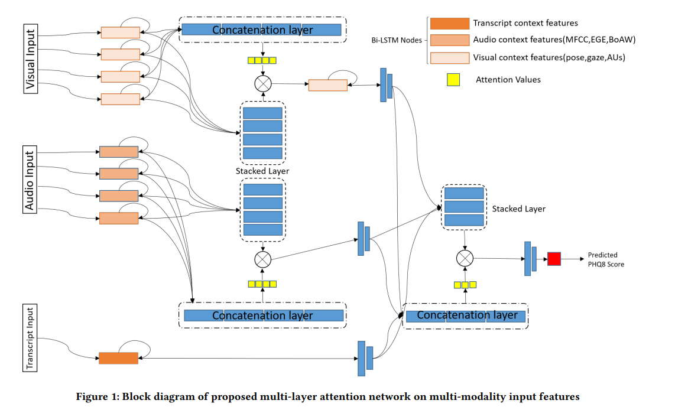

# depression_papers
It is a personal conclusion of papers using Extended-DAIC dataset (AVEC 2019 DDS). E-DAIC includes 275 samples, which is larger than DAIC-WOZ with 189 samples. Evaluation metrics for E-DAIC are 'CCC':arrow_up: and 'RMSE':arrow_down:. 

For more information of papers with other depression datasets, please refer to my [[知乎]()] (TODO)

## Extended DAIC-WOZ

### Papers that report results on the dev set only are marked with :sparkles:, those do a classification task are marked with :rocket:. *Reporting results on the test set is recommended*

* **[AVEC 2019 Workshop and Challenge: State-of-Mind, Detecting Depression with AI, and Cross-Cultural Affect Recognition](https://dl.acm.org/doi/abs/10.1145/3347320.3357688) (2019)**: 

A baseline method for AVEC 2019. This paper has some information about E-DAIC. **Test RMSE : 6.37**

* **[A Multi-Modal Hierarchical Recurrent Neural Network for Depression Detection](https://dl.acm.org/doi/abs/10.1145/3347320.3357696) (2019)**

CCC : .442 ; RMSE : 5.50

* **[Multi-modality Depression Detection via Multi-scale Temporal Dilated CNNs](https://dl.acm.org/doi/abs/10.1145/3347320.3357695)**

CCC : .430 ; RMSE : 5.91

* **[Multimodal Fusion of BERT-CNN and Gated CNN Representations for Depression Detection](https://dl.acm.org/doi/abs/10.1145/3347320.3357694) (2019)**

TODO

* **[A Multimodal Framework for State of Mind Assessment with Sentiment Pre-classification](https://dl.acm.org/doi/abs/10.1145/3347320.3357689) (2019)**

CCC : .531

* **[Multi-level Attention Network using Text, Audio and Video for Depression Prediction](https://dl.acm.org/doi/abs/10.1145/3347320.3357697) (2019) :sparkles:**

* **[Multimodal Deep Learning Framework for Mental Disorder Recognition](https://ieeexplore.ieee.org/abstract/document/9320154) (FG 2020):sparkles: :rocket:**

* **[Multi-Modal Adaptive Fusion Transformer Network for the Estimation of Depression Level](https://www.mdpi.com/1424-8220/21/14/4764/htm#) (2021)**:sparkles:

Dataset references : 

Gratch J, Artstein R, Lucas GM, Stratou G, Scherer S, Nazarian A, Wood R, Boberg J, DeVault D, Marsella S, Traum DR. The Distress Analysis Interview Corpus of human and computer interviews. InLREC 2014 May (pp. ‪3123-3128‬)

DeVault, D., Artstein, R., Benn, G., Dey, T., Fast, E., Gainer, A., Georgila, K., Gratch, J., Hartholt, A., Lhommet, M., Lucas, G., Marsella, S., Morbini, F., Nazarian, A., Scherer, S., Stratou, G., Suri, A., Traum, D., Wood, R., Xu, Y., Rizzo, A., and Morency, L.-P. (2014). “SimSensei kiosk: A virtual human interviewer for healthcare decision support”. In Proceedings of the 13th International Conference on Autonomous Agents and Multiagent Systems (AAMAS’14), Paris

